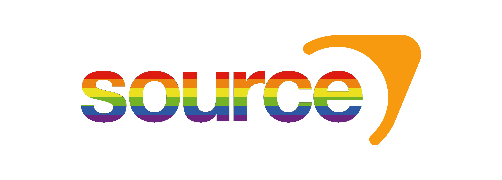

  

<h3 align="center">🌱 Source Engine Stalea</h3>

<i>A community-maintained fork of Valve's Source Engine</i>

  
  
  

💬 Come say hi on <a href="https://discord.gg/3YQvzEe2kn">Discord</a> — questions, bugs, and PRs are always welcome!

 

Information from [wikipedia](https://wikipedia.org/wiki/Source_(game_engine)):

Source is a 3D game engine developed by Valve.
It debuted as the successor to GoldSrc with Half-Life: Source in June 2004,
followed by Counter-Strike: Source and Half-Life 2 later that year.
Source does not have a concise version numbering scheme; instead, it was released in incremental versions

This project is built on top of the leaked TF2 2018 source code. As such, this project is for educational and non-commercial use only — please don't use it commercially.

This project uses the [WAF build system](https://waf.io/book) — check the book if you hit build-system-specific issues.

# Features:
- Android, iOS, OSX, FreeBSD, Windows, Linux( glibc, musl ) support
- Arm support( except windows )
- 64bit support
- Modern toolchains support
- Fixed many undefined behaviours
- Touch support( even on windows/linux/osx )
- VTF 7.5 support
- PBR support
- bsp v19-v21 support( bsp v21 support is partial, portal 2 and csgo maps works fine )
- mdl v46-49 support
- Removed useless/unnecessary dependencies
- Achivement system working without steam
- Fixed many bugs
- Serverbrowser works without steam

# Current tasks
- Fix compatibility issues with newer versions of games
- Improve iOS support

## 🛠️ Building

Ready to compile it yourself? Head over to the wiki for step-by-step instructions for your platform:

📖 [**Build Instructions**](https://github.com/soleil-des-chats/source-engine-stalea/wiki/Source-Engine)

# Credits
- [Nillerusr](https://github.com/nillerusr/source-engine) — original fork
